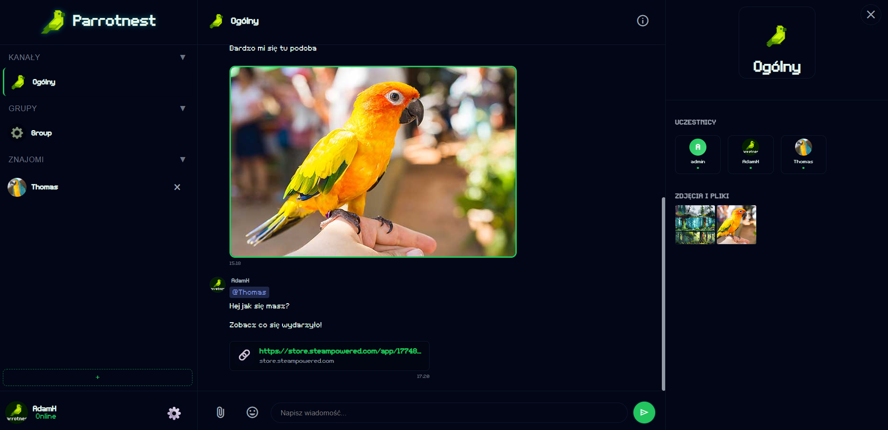
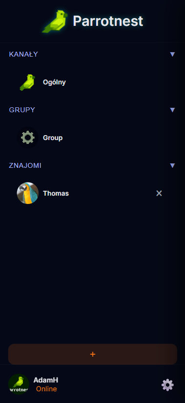
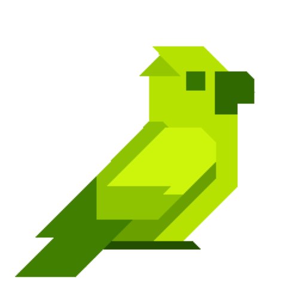

**The Ultimate Real-Time Chat & Collaboration Platform**

---

## 🦜 Welcome to the Nest!

Tired of bloated, privacy-invasive communication tools? **Parrotnest** is your ultimate escape. Designed from the ground up for communities, schools, friend groups, and LAN networks, it delivers lightning-fast, ultra-secure, and deeply customizable real-time communication.

Version **V13 "Parrot Egg Edition"** is our most refined experience yet—packed with seamless mobile navigation, enhanced security, and a beautiful UI. 

  

---

## 🔥 Why Choose Parrotnest?

### 💬 Unmatched Communication
- **Global & Private:** Jump into the lively Global Channel or keep it intimate with secure Private Messages and custom Groups.
- **Rich Media Magic:** Share images, videos, reactions, and replies effortlessly. 
- **Oops? Edited!:** Fix your typos gracefully. Edit messages within a 15-minute window with a transparent history.

### 🎨 Your Nest, Your Rules
Don't settle for boring defaults. Express yourself!
- **Stunning Themes:** Choose from Original, Dark, Classic, Neon, Forest, or High Contrast.
- **Adaptive UI:** Dynamic text sizes and a Plain Text mode for ultimate focus.
- **Custom Sounds:** Total control over your notifications. 

### 📱 Perfect on Mobile
Stay connected wherever you roam. Our V13 update brings unparalleled polish to the mobile experience, making navigation between channels, groups, and friends silky smooth.

  

---

## 🖥️ Powerful Yet Lightweight

Parrotnest isn't just a web app. It comes with a robust **Windows Desktop Host** that makes managing your server a breeze!

  

- 🚀 **Lightning Fast API:** Powered by ASP.NET Core & SignalR.
- 🌐 **Modern Client:** Responsive PHP + Vanilla JS interface.
- 📦 **Easy Deployment:** Dedicated one-click Desktop Installer.

---

## ⚙️ How to Get Started

It's easier than ever to set up your own Parrotnest:

1. **Download:** Grab the latest `ParrotnestInstaller.exe` from our releases.
2. **Install:** Let our dedicated installer set everything up in seconds.
3. **Launch:** Open the **Parrotnest Server Host** and hit Start.
4. **Invite:** Share your address and let the flock gather!

---

## 🛠 For the Geeks (Tech Stack)

Built with passion and the latest technologies:
- **Backend:** .NET 11.0, ASP.NET Core, SignalR, Entity Framework Core (SQLite)
- **Frontend:** PHP, Vanilla JS, Custom `CssGen 4.1` tool

---

## 👑 The Masterminds (JGS Team)

  

Crafted with 💖 by the **JGS Team**:
- 👨‍💻 Adam Hnatko ("Hnato")
- 🛠 Igor Kondraciuk ("Flubi3604")
- 🐍 Jakub Fedorowicz ("John0G1thub")

 
&copy; 2026 Parrotnest - JGS Team.  
<i>Connect with your flock.</i>

